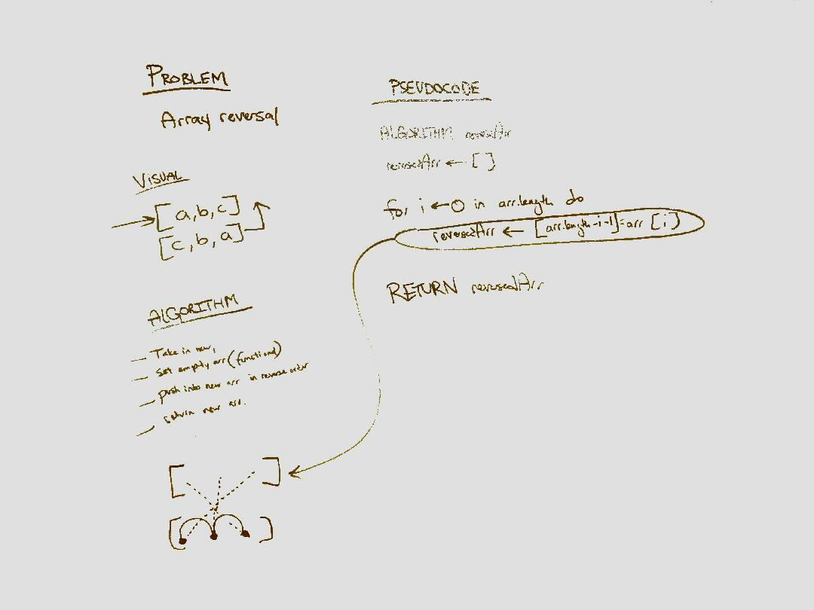

# Data Structures and Algorithms

[Build status]

*Jason Burns, Code Fellows seattle401d24*

### Table of contents

  * [array_reverse](#array_reverse)

##array_reverse

#### Challenge
Write a function called reverseArray which takes an array as an argument. Without utilizing any of the built-in methods available to your language, return the provided array argument with elements in reversed order.

##White Board

##Notes:
1.
2.

[:top:](#contents)
